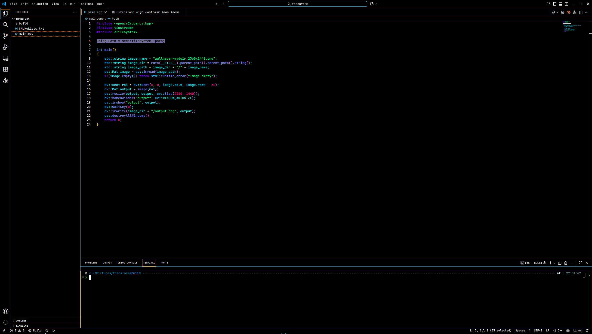

# High Contrast Neon
This theme is based on High Contrast Dark of VSCode Default color scheme, hopefully it is not that bad...

below is an example image of the theme

## Installation

Search **High Contrast Neon Theme** in Extensions of VSCode and simply install it

